<picture>
  <source media="(prefers-color-scheme: dark)" srcset="assets/banner-dark.svg">
  <source media="(prefers-color-scheme: light)" srcset="assets/banner-light.svg">
  
</picture>

<picture>
  <source media="(prefers-color-scheme: dark)" srcset="assets/typing-dark.svg">
  <source media="(prefers-color-scheme: light)" srcset="assets/typing-light.svg">
  
</picture>

**Yunus** — otel ve klinik için AI ürünleri: **hotelai** · **dentai**
 AI products for hotels and clinics.

### Şu an ne yapıyorum

- 🏨 **hotelai** — otel operasyon asistanı
- 🦷 **dentai** — klinik asistanı
- 🤖 **Çok ajanlı AI ofisi** — ürünleri birlikte geliştiren AI ajan ekibi

### Kullandıklarım

### Katkılar

<!-- yilan:basla -->
<picture>
  <source media="(prefers-color-scheme: dark)" srcset="https://raw.githubusercontent.com/yunsemmr/yunsemmr/output/github-contribution-grid-snake-dark.svg">
  <source media="(prefers-color-scheme: light)" srcset="https://raw.githubusercontent.com/yunsemmr/yunsemmr/output/github-contribution-grid-snake.svg">
  
</picture>
<!-- yilan:bitir -->
